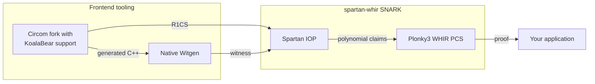

# spartan-whir

`spartan-whir` is a Spartan-based SNARK built on
[Plonky3](https://github.com/Plonky3/Plonky3). Its Poseidon instantiation uses
Plonky3's KoalaBear arithmetic, Poseidon2 primitives, sumcheck implementation,
and WHIR PCS.

## Architecture



The frontend is the
[KoalaBear Circom fork](https://github.com/alxkzmn/circom/tree/koala-bear). It
emits the R1CS and the
[native C++ witness generator](https://github.com/alxkzmn/circom/tree/koala-bear/code_producers/src/c_elements).
The `spartan-whir` SNARK combines the
[Spartan](https://eprint.iacr.org/2019/550) IOP with the
[Plonky3 WHIR PCS](https://github.com/alxkzmn/Plonky3/tree/b03991a120b511cf0342e9ef0703a84a803041a4/whir),
which implements [WHIR](https://eprint.iacr.org/2024/1586). Its full-ZK
protocol follows
[Zero-Knowledge IOPPs for Constrained Interleaved Codes](https://eprint.iacr.org/2026/391).

## Quick Start

This example compiles a KoalaBear Circom circuit, generates a witness, creates
full-ZK DirectSparse keys, produces a proof, and verifies it. It requires a
Circom 2.2 build with KoalaBear support, a C++ compiler, GMP, and the
`nlohmann-json` headers.

Create `example.circom`:

```circom
pragma circom 2.2.0;

template Example() {
    signal input x;
    signal input secret;
    signal output y;
    signal t0;
    signal t1;
    signal t2;

    t0 <== x * secret;
    t1 <== t0 + x;
    t2 <== t1 * t1;
    y <== t2 + 3;
}

component main { public [x] } = Example();
```

Create `input.json`:

```json
{"x":"5","secret":"7"}
```

Compile the circuit and generate the witness:

```bash
mkdir -p build
circom example.circom --prime koalabear --r1cs --c -o build
make -C build/example_cpp
build/example_cpp/example input.json build/example.wtns
```

On macOS with Homebrew, pass the dependency paths explicitly if the compiler
does not find them:

```bash
make -C build/example_cpp \
  CC="g++ -L$(brew --prefix gmp)/lib" \
  CFLAGS="-std=c++11 -O3 -I. -I$(brew --prefix gmp)/include -I$(brew --prefix nlohmann-json)/include"
build/example_cpp/example input.json build/example.wtns
```

Generate the proving and verifying keys:

```bash
cargo run --release --features parallel --example end_to_end -- \
  setup build/example.r1cs build/proving-key.bin build/verifying-key.bin
```

Generate a proof from the witness:

```bash
cargo run --release --features parallel --example end_to_end -- \
  prove build/proving-key.bin build/example.wtns build/proof.bin
```

Verify the proof:

```bash
cargo run --release --features parallel --example end_to_end -- \
  verify build/verifying-key.bin build/proof.bin
```

Setup is circuit-specific and can be reused for multiple witnesses. The proof
contains its public Spartan instance, so verification needs only the verifying
key and proof files. The example stores keys and proofs with `bincode` and
rebuilds derived proving-key caches after loading the proving key.

## SNARK Instantiations

`PoseidonEngine<Ext>` is the client-side SNARK instantiation. It uses the
KoalaBear Poseidon2 permutation shape used by Plonky3 WHIR. Circuits are written
over KoalaBear.

### Linked Witness Generation

The Poseidon proving API uses a linked native witness generator. A
`PoseidonWitnessGenerator` loads a circuit `.dat` payload once through the
linked loader and stores the returned circuit handle plus FFI function pointers.
`PoseidonProvingKey::prove_from_witness_generator` passes an application-defined
binary input buffer into the linked function, which fills private/internal
witness and public-value buffers directly as canonical KoalaBear `u32` values.

Public values are ordered as `public_outputs || public_inputs`, matching the
Circom R1CS wire layout. The witness buffer contains witness columns only.
The default proving path does not run a separate full R1CS satisfaction pass
before proving; `prove_from_witness_generator_checked` is available when
debugging a linked witness generator and a row-level validation error is useful.
The path has no JSON file, `.wtns` file, subprocess, or witness re-import.

### Proving Key Setup and Loading

A proving key returned by `setup_poseidon`, `PoseidonProvingKey::setup`, or
`SpartanProtocol::setup_with_config` is ready to prove. Setup builds derived
prover data, including the direct-mode row-binding layout used by
`MatrixClosingMode::DirectSparse`.

Serialized proving keys do not include every derived cache. After deserializing
a proving key, call `prepare_for_proving()` before proving:

```rust
let mut pk: PoseidonProvingKey<OcticBinExtension> =
    bincode::deserialize(&pk_bytes)?;
pk.prepare_for_proving()?;
let proof = pk.prove(witness, public_inputs)?;
```

`prove` treats missing derived prover data as an invalid configuration instead
of falling back to a slower path. `Spark` proving keys may use the same
preparation call so load paths stay uniform.

## Protocol Capabilities

- Outer cubic and inner quadratic sumchecks
- R1CS operations: `pad_regular`, `multiply_vec`, `bind_row_vars`, `evaluate_with_tables`, `witness_to_mle`
- Public instance is external to the proof: `verify(vk, instance, proof, challenger)`
- `prove` returns `(instance, proof)`
- WHIR verification is split into commitment-parse and finalize phases to preserve transcript continuity
- The `SpartanProtocol` PCS statement path accepts point-evaluation claims

### Full Zero Knowledge for DirectSparse

Spartan-WHIR supports no-ZK proving with DirectSparse or Spark matrix closing,
and full-ZK proving with DirectSparse:

| Privacy | DirectSparse |       Spark |
| ------- | -----------: | ----------: |
| No ZK   |  Implemented | Implemented |
| Full ZK |  Implemented | Unsupported |

The no-ZK API uses `PoseidonProvingKey`, `PoseidonVerifyingKey`,
`PoseidonProof`, and `PoseidonSpartanProtocol`. The unqualified
`Plonky3WhirPcs` name means plain WHIR and is the no-ZK PCS. Both DirectSparse
and Spark use this API.

The full-ZK DirectSparse API uses `PoseidonZkProvingKey`,
`PoseidonZkVerifyingKey`, `PoseidonZkProof`, and
`PoseidonZkSpartanProtocol`. `setup_poseidon_zk` returns DirectSparse keys.
Passing `MatrixClosingMode::Spark` to full-ZK setup returns
`UnsupportedFullZkMatrixClosing` before preprocessing or transcript work.
Both proving-key families expose `prove`, witness-generator proving, and their
checked variants. Full-ZK callers that need deterministic test randomness can
use `PoseidonZkProvingKey::prove_with_rng`.

The outer protocol follows Construction 11.4 of the ZK-WHIR paper, adapted to
the independently padded row and column domains used here:

- `3 * num_outer_rounds` cubic inner masks hide the `A`, `B`, and `C` claims;
  every mask vanishes at zero and one.
- `num_outer_rounds` degree-seven outer masks hide the round polynomials.
- The outer combining challenge is sampled after `mu_tilde`; the final outer
  challenge is rejection-sampled outside `{0, 1}` so the inner-mask evaluation
  is nonzero as required by the simulator argument.
- A fresh batching challenge authenticates the inner-mask endpoint constraints,
  the disclosed outer-mask evaluations, and the masked matrix claim in one
  committed relation.

The inner product is proved with Plonky3's HVZK sumcheck. Its application-mask
claim is passed as the auxiliary claim, so the carried covectors receive the
same `eps * 2^-k` scale as in Plonky3's WHIR composition. The final
`HidingWhirVerifier::verify_relation` call settles the witness equality term,
the application masks, and the inner-sumcheck masks without disclosing a
witness evaluation. The integration calls the lower-level
`HidingWhirProver::prove_relation` and `HidingWhirVerifier::verify_relation`
methods directly.

The DirectSparse composition adapts Construction 11.4's succinct-linear-form
handoff by retaining an explicit HVZK inner sumcheck and passing one equality
constraint to hiding WHIR. RBR soundness composes because the fresh batching
challenge binds every disclosed mask equation before the inner sumcheck, and
the final WHIR relation binds the resulting source and mask covectors. The
powers-of-the-batching-challenge combination is the paper's zero-evader
instantiation. For honest-verifier zero knowledge, the endpoint-zero inner masks
one-time-pad the three matrix claims at the non-Boolean final point, the
degree-seven masks simulate the outer wires, Plonky3's sumcheck simulator covers
the inner transcript, and hiding WHIR simulates the committed relation. Tests
include a witness-free accepting simulator for the outer transcript,
fixed-witness transcript divergence, masked-claim checks, and Plonky3's own
sumcheck and WHIR simulator suites.

Setup enforces an extension-aware soundness bound before proving. For `n_x`
outer rounds, `n_y` inner rounds, and inner masked-sumcheck degree `d`, the
local algebraic error is conservatively bounded by
`(15 * n_x + d * n_y + 4) / |Ext|`. The final P3 relation and this local bound
each receive a two-bit reserve over the requested security level.
`SecurityConfig` accepts targets from 80 through 123 bits because the
eight-element KoalaBear Poseidon digest provides about 123.95 bits of collision
security. Targets above 123 bits are rejected before extension-specific checks.
At the 123-bit maximum, the full-ZK bound rejects the quartic extension; the
quintic and octic extensions satisfy the bound. Setup also validates the
length-4 and length-8 application-mask domains against the extension two-adicity
before constructing or allocating their encodings.

The full-ZK `spartan-whir-full-zk-v0` Fiat-Shamir order is:

1. ZK domain separator, ZK geometry, and public inputs
2. inner-mask commitment
3. hiding-WHIR relation domain separator
4. witness commitment
5. outer-mask commitment
6. `mu_tilde`, outer combining challenge, equality point, and outer rounds
7. outer-mask evaluations, masked matrix claims, matrix batching challenge, and relation batching challenge
8. Plonky3 HVZK inner sumcheck
9. hiding-WHIR committed-relation proof

`PoseidonZkProvingKey::prove` draws mask and WHIR randomness from an
operating-system-seeded `StdRng`. `prove_with_rng` accepts a caller-supplied
`Rng + CryptoRng`, which supports deterministic protocol tests without
weakening the public API's RNG requirement.

No-ZK transcripts use `spartan-whir-no-zk-v0`. The no-ZK and full-ZK domain
separators have the same canonical body after their protocol identifiers, but
produce different transcript challenges. The plain-WHIR point-evaluation PCS
and hiding-WHIR committed-relation proof also have separate transcript domain
separators.

## Extension Support

- Quartic and quintic are covered by the PCS and protocol test matrix
- Octic is available in the engine surface and is used by the SHA-256 benchmarks
- Benchmarking with different extensions is expected to be workload-dependent; extension choice is part of the measurement surface

The WHIR integration disables univariate skip.

## Implemented Modules

- `src/engine.rs`
  - Generic `PoseidonEngine<Ext>` plus quartic/quintic/octic extension aliases and challenger constructors
- `src/plonky3_whir_pcs.rs`
  - Plonky3-WHIR-backed `MlePcs`
  - `verify_parse_commitment` / `verify_finalize` helpers
- `src/r1cs.rs`
  - Canonical padding and sparse-matrix evaluation helpers
- `src/sumcheck.rs`
  - Transcript-driven outer and inner sumcheck proving
- `src/sumcheck_replay.rs`
  - Verifier replay of compact sumcheck rounds using Plonky3 interpolation
- `src/protocol.rs`
  - Spartan setup, proving, and verification orchestration
- `src/profiling.rs`
  - Protocol hooks (`ProtocolObserver`, `ProtocolStage`)
  - Tracing span emission for proof-size breakdown (`trace_proof_size_report`)

## Related Design Notes

- `Spartan-LC` (linear-constraint-based Spartan path) is documented separately:
  - See [`SPARTAN_LC_UPGRADE_PLAN.md`](SPARTAN_LC_UPGRADE_PLAN.md)
  - The implementation in this crate uses the R1CS-based Spartan path.

## Synthetic R1CS Fixtures

- `spartan-whir` provides synthetic fixture generators for targeted WHIR witness commitment sizes:
  - `generate_satisfiable_fixture(...)`
  - `generate_satisfiable_fixture_for_pow2(k)`
- These helpers produce satisfiable regular R1CS tuples `(shape, witness, public_inputs)` with witness length exactly `2^k`.
- These helpers support large-size protocol tests and benchmark scaffolding.
- The benchmark fixtures are synthetic and only shape-similar to target circuits such as Spartan2 SHA-256.
- They model rough constraint count / witness size / row sparsity for benchmark scaffolding.

## Run Tests

```bash
cargo test
```

Test suite includes:

- Plonky3-WHIR PCS lifecycle and ordering regression tests
- R1CS canonicalization and table-evaluation consistency tests
- Sumcheck roundtrip, replay, tamper, round-count, and interpolation checks
- Spartan protocol end-to-end success/failure scenarios
  - tampered commitment rejection
  - tampered outer claims rejection
  - tampered `witness_eval` rejection
  - tampered PCS proof rejection
  - wrong public-input rejection
- Transcript checkpoint consistency tests
- Non-invertible witness recovery denominator guard tests

Additional targeted-size commands:

```bash
cargo test protocol_e2e_target_2_pow_18
cargo test protocol_e2e_target_2_pow_22 -- --ignored
```

## Run Benchmarks

### SHA-256 No-ZK and Full-ZK

The `sha256_full_zk` Criterion target compares the no-ZK and full-ZK paths on
a cached SHA-256 circuit. It measures setup, linked witness
generation plus proving, and verification separately. Proving rotates through
valid SHA-256 inputs, verification rotates through a corpus of valid proofs,
and proof size is reported outside the timed intervals. The target only loads
existing artifacts from `target/sha256-cache`; it never compiles the circuit.
The default workload is 2048 bytes; set `SHA256_ZK_BENCH_SIZE=1024` to select
another cached circuit. The default extension is octic; set
`SHA256_ZK_BENCH_EXTENSION=quintic` to benchmark the quintic extension. A
non-octic run must also set `SHA256_ZK_BENCH_SCHEDULE` to its selected schedule
label. The benchmark uses a 123-bit Johnson-bound target.
`SHA256_BENCH_ZK_ELL` and `SHA256_BENCH_ZK_MASK_LOG_INV_RATE` override the
default ZK mask parameters.

The `sha256_bench` example exposes privacy and matrix closing as separate
axes. Set `SHA256_BENCH_PROOF_MODES=no-zk,full-zk` and
`SHA256_BENCH_MODES=direct,spark` for diagnostic schedule screening. Full-ZK
Spark reports the setup-time unsupported error. The example's `Instant` output
is diagnostic; use Criterion results for performance comparisons.

```sh
RUSTFLAGS='-C target-cpu=native -C debuginfo=0' \
cargo bench --features parallel --bench sha256_full_zk
```

Criterion retains the raw estimates and sample data under
`target/criterion/sha256_<size>b_<extension>_*`. Set
`SHA256_ZK_BENCH_CORPUS_SIZE` to change the proof/input corpus size; the default
is 16.

### Sumcheck Replay

The sumcheck replay benchmark isolates verifier replay for the quadratic inner,
cubic outer, and quartic Spark round shapes used by the IOP:

```bash
RUSTFLAGS="-C target-cpu=native -C debuginfo=0" \
cargo bench --bench sumcheck_replay --features parallel -- --noplot
```
