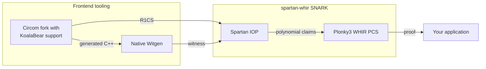

# spartan-whir

`spartan-whir` is a Spartan-based SNARK built on
[Plonky3](https://github.com/Plonky3/Plonky3). Its Poseidon instantiation uses
Plonky3's KoalaBear arithmetic, Poseidon2 primitives, sumcheck implementation,
and WHIR PCS.

## Architecture



The frontend is the
[KoalaBear Circom fork](https://github.com/alxkzmn/circom/tree/koala-bear). It
emits the R1CS and the
[native C++ witness generator](https://github.com/alxkzmn/circom/tree/koala-bear/code_producers/src/c_elements).
The `spartan-whir` SNARK combines the
[Spartan](https://eprint.iacr.org/2019/550) IOP with the
[Plonky3 WHIR PCS](https://github.com/Plonky3/Plonky3/tree/main/whir),
which implements [WHIR](https://eprint.iacr.org/2024/1586). Its full-ZK
protocol follows
[Zero-Knowledge IOPPs for Constrained Interleaved Codes](https://eprint.iacr.org/2026/391).

## Quick Start

This example compiles a KoalaBear Circom circuit, generates a witness, creates
116-bit full-ZK DirectSparse keys over the quintic extension, produces a proof,
and verifies it. It requires a Circom 2.2 build with KoalaBear support, a C++
compiler, GMP, and the `nlohmann-json` headers.

Create `example.circom`:

```circom
pragma circom 2.2.0;

template Example() {
    signal input x;
    signal input secret;
    signal output y;
    signal t0;
    signal t1;
    signal t2;

    t0 <== x * secret;
    t1 <== t0 + x;
    t2 <== t1 * t1;
    y <== t2 + 3;
}

component main { public [x] } = Example();
```

Create `input.json`:

```json
{ "x": "5", "secret": "7" }
```

Compile the circuit and generate the witness:

```bash
mkdir -p build
circom example.circom --prime koalabear --r1cs --c -o build
make -C build/example_cpp
build/example_cpp/example input.json build/example.wtns
```

On macOS with Homebrew, pass the dependency paths explicitly if the compiler
does not find them:

```bash
make -C build/example_cpp \
  CC="g++ -L$(brew --prefix gmp)/lib" \
  CFLAGS="-std=c++11 -O3 -I. -I$(brew --prefix gmp)/include -I$(brew --prefix nlohmann-json)/include"
build/example_cpp/example input.json build/example.wtns
```

Generate the proving and verifying keys:

```bash
cargo run --release --features parallel --example end_to_end -- \
  setup build/example.r1cs build/proving-key.bin build/verifying-key.bin
```

Generate a proof from the witness:

```bash
cargo run --release --features parallel --example end_to_end -- \
  prove build/proving-key.bin build/example.wtns build/proof.bin \
  build/public-inputs.bin
```

Verify the proof:

```bash
cargo run --release --features parallel --example end_to_end -- \
  verify build/verifying-key.bin build/public-inputs.bin build/proof.bin
```

Setup is circuit-specific and can be reused for multiple witnesses. The proof
contains its public Spartan instance, but verification also requires the
expected public inputs selected by the verifier. In a deployment,
`public-inputs.bin` must come from the application or another trusted statement
source. Treat a copy supplied with the proof as untrusted. The example emits
that file from `prove` to make the command-line workflow complete.

The example stores artifacts with fixed-integer `bincode`, rejects trailing
bytes, and applies role-specific decode limits: 4 GiB for a proving key,
512 MiB for a verifying key, 256 MiB for a proof, and 16 MiB for public inputs.
It rebuilds derived proving-key caches after loading the proving key.

## SNARK Instantiations

#### Recursive verification in LeanVM

The fixtures under [`testdata/leanvm-m0`](testdata/leanvm-m0) define the input and statement boundary for recursively verifying Spartan-WHIR proofs in [LeanVM](https://github.com/leanEthereum/leanVM). The verifier guest decodes a Spartan-WHIR proof from private witness words, verifies it inside the VM, recomputes the application statement digest, and exposes that digest as the public input of the LeanVM execution proof. The execution proof attests that the fixed guest accepted the child Spartan-WHIR proof for the bound application statement.

The control fixture fixes the no-ZK Poseidon2, quintic, DirectSparse correctness profile, a canonical field-word guest encoding, the eight-element statement digest, a verifier transcript trace, and single-value rejection fixtures. The protocol manifest in that directory also records the matched full-ZK DirectSparse and SPARK candidate configurations.

Regenerate it with `cargo run --bin leanvm-m0-fixture -- ...` using the exact source revisions described in the fixture README. Run `cargo test --test leanvm_m0` to check deterministic reproduction and native verification.

The `leanvm_full_zk` module provides engine-typed DirectSparse and SPARK guest encoders, decoders, statement digests, and fixed verifier-configuration extraction. Call `encode_full_zk_direct_guest_words::<E>` with `decode_full_zk_direct_guest_words::<E>`, or `encode_full_zk_spark_guest_words::<E>` with `decode_full_zk_spark_guest_words::<E>`. The engine type fixes the Poseidon profile in the header and statement digest, and each decoder requires exact input consumption before returning the ordinary structured proof used by native verification.

The checked synthetic full-ZK DirectSparse fixtures are [`testdata/leanvm-full-zk-direct-poseidon1`](testdata/leanvm-full-zk-direct-poseidon1) and [`testdata/leanvm-full-zk-direct-poseidon2`](testdata/leanvm-full-zk-direct-poseidon2). Generate them with `cargo run --bin leanvm-full-zk-fixture -- <output-directory> <spartan-whir-commit>` and add `--features poseidon1` for the Poseidon1 fixture. Their manifests record the Spartan-WHIR and Plonky3 revisions, implementation-source hashes, artifact hashes, deterministic seeds, verifier constants, transcript trace, and rejection inputs. `cargo test --test leanvm_full_zk_codec` reproduces the selected binary profile byte for byte, checks both manifests, and exercises both engine-typed codecs in every build.

Generate the selected Poseidon1 SPARK application fixture with `cargo run --features poseidon1 --bin leanvm-full-zk-spark-fixture -- <output-directory> <spartan-whir-commit> <leanvm-upstream-base> <leanvm-branch-head> <sol-spartan-whir-commit>`. The generator writes the padded guest input, verifier constants, statement, layout, transcript trace, and mutation patches; its manifest records the supplied revisions and implementation-source hashes.

`PoseidonEngine<Ext>` is the client-side SNARK instantiation. It uses the
KoalaBear Poseidon2 permutation shape used by Plonky3 WHIR. Circuits are written
over KoalaBear.

`Poseidon1Engine<Ext>` is the corresponding Poseidon1 instantiation. `setup_poseidon1_zk` creates its full-ZK proving and verifying keys. Its no-ZK and full-ZK transcript identifiers are `spartan-whir-poseidon1-no-zk-v0` and `spartan-whir-poseidon1-full-zk-v0`.

The Poseidon1 challenger, leaf hash, and Merkle-node compression use Plonky3's width-16 KoalaBear Poseidon1 permutation with an eight-element rate. Leaves use padding-free sponge hashing to eight field elements, and nodes compress two eight-element digests to eight field elements. The `poseidon1` Cargo feature selects Poseidon1 in comparison benchmarks and fixture binaries; both Poseidon1 and Poseidon2 library types are available in every build.

### Linked Witness Generation

The Poseidon proving API uses a linked native witness generator. A
`PoseidonWitnessGenerator` loads a circuit `.dat` payload once through the
linked loader and stores the returned circuit handle plus FFI function pointers.
`PoseidonProvingKey::prove_from_witness_generator` passes an application-defined
binary input buffer into the linked function, which fills private/internal
witness and public-value buffers directly as canonical KoalaBear `u32` values.

Public values are ordered as `public_outputs || public_inputs`, matching the
Circom R1CS wire layout. The witness buffer contains witness columns only.
The default proving path does not run a separate full R1CS satisfaction pass
before proving; `prove_from_witness_generator_checked` is available when
debugging a linked witness generator and a row-level validation error is useful.
The path has no JSON file, `.wtns` file, subprocess, or witness re-import.

### Key Setup and Loading

A proving key returned by `setup_poseidon`, `PoseidonProvingKey::setup`, or
`SpartanProtocol::setup_with_config` is ready to prove. Setup builds derived
prover data, including the direct-mode row-binding layout used by
`MatrixClosingMode::DirectSparse`.

Serialized proving keys do not include every derived cache. After deserializing
a proving key, call `prepare_for_proving()` before proving:

```rust
let mut pk: PoseidonProvingKey<OcticBinExtension> =
    bincode::deserialize(&pk_bytes)?;
pk.prepare_for_proving()?;
let proof = pk.prove(witness, public_inputs)?;
```

`prove` treats missing derived prover data as an invalid configuration instead
of falling back to a slower path. `Spark` proving keys may use the same
preparation call so load paths stay uniform.

SPARK verifying keys bind public matrix tables through fixed WHIR
commitments. After deserializing a SPARK verifying key, authenticate that
binding once before verification:

```rust
let mut vk: PoseidonZkVerifyingKey<OcticBinExtension> =
    bincode::deserialize(&vk_bytes)?;
vk.authenticate_spark_fixed_commitments()?;
vk.verify(&expected_public_inputs, &proof)?;
```

Authentication deterministically rebuilds the SPARK tables and commitments
from the embedded R1CS. Verifying keys returned directly by setup are ready to
use. DirectSparse verifying keys do not carry SPARK commitments and require no
preparation after deserialization.

## Protocol Capabilities

- Outer cubic and inner quadratic sumchecks
- R1CS operations: `pad_regular`, `multiply_vec`, `bind_row_vars`, `evaluate_with_tables`, `witness_to_mle`
- Public instance is external to the proof: `verify(vk, instance, proof, challenger)`
- `prove` returns `(instance, proof)`
- WHIR verification is split into commitment-parse and finalize phases to preserve transcript continuity
- The `SpartanProtocol` PCS statement path accepts point-evaluation claims

### Privacy and Matrix Closing

Privacy and matrix closing are independent configuration choices:

| Privacy | DirectSparse |       Spark |
| ------- | -----------: | ----------: |
| No ZK   |  Implemented | Implemented |
| Full ZK |  Implemented | Implemented |

The no-ZK API uses `PoseidonProvingKey`, `PoseidonVerifyingKey`,
`PoseidonProof`, and `PoseidonSpartanProtocol`. The unqualified
`Plonky3WhirPcs` name means plain WHIR and is the no-ZK PCS. Both DirectSparse
and Spark use this API.

The full-ZK API uses `PoseidonZkProvingKey`, `PoseidonZkVerifyingKey`,
`PoseidonZkProof`, and `PoseidonZkSpartanProtocol`. Set
`PoseidonZkSetupConfig::matrix_closing` to select DirectSparse or Spark. At a
116-bit end-to-end target, use `QuinticExtension` with
`recommended_quintic_whir_params` for no ZK or
`recommended_quintic_zk_whir_params` for full-ZK DirectSparse. The selected
Spark witness schedules come from `recommended_quintic_spark_whir_params` and
`recommended_quintic_spark_zk_whir_params`.
`spark_whir_params` supplies independent fixed-value, fixed-audit, and
read-table schedules. Use `recommended_quintic_spark_fixed_whir_params` for
the fixed tables and `recommended_quintic_spark_read_whir_params` for the read
tables. The corresponding octic helpers are available for explicit octic
configurations.

Spark partitions the `erow` and `ecol` base-field coordinates into commitments
whose column counts are descending powers of two. Quartic and octic extensions
use one read commitment; the quintic extension uses 8-column and 2-column read
commitments. When both audit timestamp tables fit in the unused eighth fixed
value column, they share that commitment and opening. Other table dimensions
use a separate fixed-audit commitment.

`PoseidonZkProof::closing_mode()` reports the proof payload's mode, and
verification rejects a proof whose mode differs from the verifying key.

Both proving-key families expose `prove`, witness-generator proving, and their
checked variants. Full-ZK callers that need deterministic test randomness can
use `PoseidonZkProvingKey::prove_with_rng`.

The outer protocol follows Construction 11.4 of
_Zero-Knowledge IOPPs for Constrained Interleaved Codes_, adapted to
the independently padded row and column domains used here:

- `3 * num_outer_rounds` cubic inner masks hide the `A`, `B`, and `C` claims;
  every mask vanishes at zero and one.
- `num_outer_rounds` degree-seven outer masks hide the round polynomials.
- The outer combining challenge is sampled after `mu_tilde`; the final outer
  challenge is rejection-sampled outside `{0, 1}` so the inner-mask evaluation
  is nonzero as required by the simulator argument.
- A fresh batching challenge authenticates the inner-mask endpoint constraints,
  the disclosed outer-mask evaluations, and the masked matrix claim in one
  committed relation.

The inner product is proved with Plonky3's HVZK sumcheck. Its application-mask
claim is passed as the auxiliary claim, so the carried covectors receive the
same `eps * 2^-k` scale as in Plonky3's WHIR composition. The final
`HidingWhirVerifier::verify_relation` call settles the witness equality term,
the application masks, and the inner-sumcheck masks without disclosing a
witness evaluation. The integration calls the lower-level
`HidingWhirProver::prove_relation` and `HidingWhirVerifier::verify_relation`
methods directly.

Each hiding-WHIR terminal source code contains the direct-send message
coefficients and its encoding-randomness coefficients. `spartan-whir` derives
the terminal query count and proof-of-work difficulty from their occupied
dyadic dimension, writes the query count into both the inner WHIR configuration
and the terminal oracle-randomness entry, and uses the same derivation in the
schedule scorer.

The composition adapts Construction 11.4's succinct-linear-form handoff by
retaining an explicit HVZK inner sumcheck and passing one equality constraint
to hiding WHIR. DirectSparse computes the three matrix evaluations from the
verifying key. Spark authenticates the same evaluations with its memory-product
argument and plain-WHIR openings of the fixed and read tables. Those tables
contain only the public R1CS or values derived from public transcript challenges,
so their commitments do not require hiding. The authenticated matrix RLC is the
coefficient used by the final hiding-WHIR witness relation.

RBR soundness composes because the fresh batching challenge binds every
disclosed mask equation before the inner sumcheck, and the final WHIR relation
binds the resulting source and mask covectors. The
powers-of-the-batching-challenge combination is the paper's zero-evader
instantiation. For honest-verifier zero knowledge, the endpoint-zero inner masks
one-time-pad the three matrix claims at the non-Boolean final point, the
degree-seven masks simulate the outer wires, Plonky3's sumcheck simulator covers
the inner transcript, and hiding WHIR simulates the committed relation. Tests
include a witness-free accepting simulator for the outer transcript,
fixed-witness transcript divergence, masked-claim checks, and Plonky3's own
sumcheck and WHIR simulator suites.

Setup enforces extension-aware soundness bounds before proving. For `n_x`
outer rounds, `n_y` inner rounds, and inner masked-sumcheck degree `d`, the
full-ZK Spartan algebraic error includes the conservative term
`(15 * n_x + d * n_y + 4) / |Ext|`.

Setup applies one composed integer budget in every privacy and matrix-closing
mode. DirectSparse accounts for the Spartan algebraic terms, its witness WHIR
argument, and every witness commitment-binding event. Spark adds matrix
batching, tuple compression, grand-product identities, product sumchecks,
per-layer reductions, batched table openings, and its table WHIR arguments and
commitments. The budget derives strengthened internal WHIR and Merkle targets
from the requested end-to-end target. It divides the allowed error equally
between algebraic checks, WHIR soundness, and Merkle binding. Full-ZK witness
WHIR with `n` code-switch rounds accounts for all `5n + 8` Poseidon commitment
binding events. Setup returns a structured error with the
requested bits, attainable bits, and dominant component when the extension
field, WHIR arguments, or commitments cannot meet that target.

`SecurityConfig` accepts targets from 80 through 123 bits because the
eight-element KoalaBear Poseidon digest provides about 123.95 bits of collision
security. Targets above 123 bits are rejected before extension-specific checks.
The maximum attainable end-to-end target depends on the extension field, WHIR
schedule, privacy mode, matrix-closing mode, and commitment count. Setup also
validates the length-4 and length-8 application-mask domains against the
extension two-adicity before constructing or allocating their encodings.

The full-ZK `spartan-whir-full-zk-v0` Fiat-Shamir order is:

1. ZK domain separator, ZK geometry, and public inputs
2. inner-mask commitment
3. hiding-WHIR relation domain separator
4. witness commitment
5. outer-mask commitment
6. `mu_tilde`, outer combining challenge, equality point, and outer rounds
7. outer-mask evaluations, masked matrix claims, matrix batching challenge, and relation batching challenge
8. Plonky3 HVZK inner sumcheck
9. for Spark, fixed-table commitments, the ordered read-table commitments, the memory-product proof, and fixed/read plain-WHIR openings
10. hiding-WHIR committed-relation proof

`PoseidonZkProvingKey::prove` draws mask and WHIR randomness from an
operating-system-seeded `StdRng`. `prove_with_rng` accepts a caller-supplied
`Rng + CryptoRng`, which supports deterministic protocol tests without
weakening the public API's RNG requirement.

No-ZK transcripts use `spartan-whir-no-zk-v0`. The no-ZK and full-ZK domain
separators have the same canonical body after their protocol identifiers, but
produce different transcript challenges. The plain-WHIR point-evaluation PCS
and hiding-WHIR committed-relation proof also have separate transcript domain
separators.

## Extension Support

- Quartic and quintic are covered by the PCS and protocol test matrix
- Octic is available in the engine surface and is used by the SHA-256 benchmarks
- Benchmarking with different extensions is expected to be workload-dependent; extension choice is part of the measurement surface

The WHIR integration disables univariate skip.

## Implemented Modules

- `src/engine.rs`
  - Generic `PoseidonEngine<Ext>` plus quartic/quintic/octic extension aliases and challenger constructors
- `src/plonky3_whir_pcs.rs`
  - Plonky3-WHIR-backed `MlePcs`
  - `verify_parse_commitment` / `verify_finalize` helpers
- `src/r1cs.rs`
  - Canonical padding and sparse-matrix evaluation helpers
- `src/sumcheck.rs`
  - Transcript-driven outer and inner sumcheck proving
- `src/sumcheck_replay.rs`
  - Verifier replay of compact sumcheck rounds using Plonky3 interpolation
- `src/protocol.rs`
  - Spartan setup, proving, and verification orchestration
- `src/profiling.rs`
  - Protocol hooks (`ProtocolObserver`, `ProtocolStage`)
  - Tracing span emission for proof-size breakdown (`trace_proof_size_report`)

## Related Design Notes

- `Spartan-LC` (linear-constraint-based Spartan path) is documented separately:
  - See [`SPARTAN_LC_UPGRADE_PLAN.md`](SPARTAN_LC_UPGRADE_PLAN.md)
  - The implementation in this crate uses the R1CS-based Spartan path.

## Synthetic R1CS Fixtures

- `spartan-whir` provides synthetic fixture generators for targeted WHIR witness commitment sizes:
  - `generate_satisfiable_fixture(...)`
  - `generate_satisfiable_fixture_for_pow2(k)`
- These helpers produce satisfiable regular R1CS tuples `(shape, witness, public_inputs)` with witness length exactly `2^k`.
- These helpers support protocol tests across selected witness-commitment sizes
  and sparse R1CS layouts.

## Run Tests

```bash
cargo test
```

Test suite includes:

- Plonky3-WHIR PCS lifecycle and ordering regression tests
- R1CS canonicalization and table-evaluation consistency tests
- Sumcheck roundtrip, replay, tamper, round-count, and interpolation checks
- Spartan protocol end-to-end success/failure scenarios
  - tampered commitment rejection
  - tampered outer claims rejection
  - tampered `witness_eval` rejection
  - tampered PCS proof rejection
  - wrong public-input rejection
- Transcript checkpoint consistency tests
- Non-invertible witness recovery denominator guard tests

Additional targeted-size commands:

```bash
cargo test protocol_e2e_target_2_pow_18
cargo test protocol_e2e_target_2_pow_22 -- --ignored
```

## Run Benchmarks

#### SPARK proof encoding

`Poseidon1ZkSpartanProtocol::prove_compressed_with_rng` and the corresponding Poseidon2 method produce an opt-in full-ZK SPARK transport proof. Serialize it with `CompressedZkProofFor::to_bytes`, parse it with `from_bytes`, and pass the result to `verify_compressed`. The verifier reconstructs omitted field values and runs the original verification checks. Commitments, WHIR schedules and transcript operations are preserved. The ordinary proof APIs and LeanVM guest input format retain their existing encoding.

`ProofCompressionOptions` controls structured initial rows, fresh hiding rows, 31-bit field packing, compact integers, factored SPARK product rounds and final WHIR rows. Further options remove derived product fields, compact small metadata and encode nonadjacent duplicate columns. Its default leaves every option disabled for controlled comparisons. Use `ProofCompressionOptions::recommended()` for the choices retained on the selected 2048-byte SHA-256 workload.

The `spark_proof_compression` Criterion target fixes the selected Poseidon1, quintic, 116-bit full-ZK SPARK schedule for the optimized 2048-byte SHA-256 circuit. It compares cumulative encodings on matched valid inputs and measures linked witness generation plus proving and encoding, encoding alone, and decoding plus native verification:

```bash
RUSTFLAGS='-C target-cpu=native -C debuginfo=0' \
RAYON_NUM_THREADS=12 \
SHA256_BENCH_WORKDIR=target/sha256-optimized-cache \
cargo bench --features parallel,poseidon1 --bench spark_proof_compression
```

`SPARK_COMPRESSION_VARIANTS` selects comma-separated variant names emitted by the target; `SPARK_COMPRESSION_PHASES` selects `end_to_end`, `encode` or `decode_verify`. Both default to `all`. `SPARK_COMPRESSION_SIZES_ONLY=1` runs the correctness and size comparison without timing. `SPARK_COMPRESSION_CORPUS_SIZE` defaults to four and must be at least four. `SPARK_COMPRESSION_SAMPLES`, `SPARK_COMPRESSION_WARMUP_SECONDS` and `SPARK_COMPRESSION_MEASUREMENT_SECONDS` control Criterion; `SPARK_COMPRESSION_REVERSE=1` reverses the candidate order. `SPARK_COMPRESSION_REPORT` selects the JSON size report, defaulting to `target/spark-proof-compression-sizes.json`. The report includes configuration, per-input sizes and transcript challenge comparisons. See the [proof-size analysis and measurements](benchmark-results/2026-09-05-spark-proof-size/README.md) for the optimization scope and reconstruction equations.

The matched corpus uses one thread so repeated proofs select the same PoW witnesses. Timed operations use `RAYON_NUM_THREADS`. `SPARK_COMPRESSION_DUMP_DIR` optionally writes the first corpus proof for each variant outside the timed intervals.

### SHA-256 No-ZK and Full-ZK

The `sha256_full_zk` Criterion target compares no-ZK DirectSparse, no-ZK Spark,
full-ZK DirectSparse, and full-ZK Spark on a cached SHA-256 circuit. It measures
linked witness generation plus proving and verification. All four proving
variants rotate through the same fixed corpus of valid SHA-256 inputs,
verification rotates through the corresponding corpus of valid proofs, and
proof size is reported outside the timed intervals. The target only loads
existing artifacts from `SHA256_BENCH_WORKDIR`, which defaults to
`target/sha256-cache`; it never compiles the circuit.
The default workload is 2048 bytes; set `SHA256_ZK_BENCH_SIZE=1024` to select
another cached circuit. The default `selected` extension mode benchmarks all
four variants over the quintic extension. Set
`SHA256_ZK_BENCH_EXTENSION=octic` to run all four variants over octic, or set
it to `spark` to compare quintic and octic Spark in one invocation.
`SHA256_ZK_BENCH_SECURITY_BITS` selects the end-to-end security target and
defaults to 116.
`SHA256_ZK_BENCH_NO_ZK_DIRECT_SCHEDULE`,
`SHA256_ZK_BENCH_NO_ZK_SPARK_SCHEDULE`,
`SHA256_ZK_BENCH_FULL_ZK_DIRECT_SCHEDULE`, and
`SHA256_ZK_BENCH_FULL_ZK_SPARK_SCHEDULE` override the selected helper schedule
for one witness commitment. `SHA256_ZK_BENCH_SPARK_FIXED_VALUE_SCHEDULE`,
`SHA256_ZK_BENCH_SPARK_FIXED_AUDIT_SCHEDULE`, and
`SHA256_ZK_BENCH_SPARK_READ_SCHEDULE` override the three SPARK table schedules.
In a forced single-extension run,
`SHA256_ZK_BENCH_SCHEDULE` supplies a shared schedule before the per-variant
overrides are applied.
For a proving-only single-variant measurement, set
`SHA256_ZK_BENCH_PROVING_ONLY=1` and choose `no_zk_direct`, `full_zk_direct`,
`no_zk_spark`, or `full_zk_spark` with
`SHA256_ZK_BENCH_SINGLE_PROVING_VARIANT`. Only the selected key is constructed.
`SHA256_BENCH_ZK_ELL` and `SHA256_BENCH_ZK_MASK_LOG_INV_RATE` override the
default ZK mask parameters.

The `sha256_bench` example exposes privacy and matrix closing as separate
axes. Set `SHA256_BENCH_PROOF_MODES=no-zk,full-zk` and
`SHA256_BENCH_MODES=direct,spark` for diagnostic schedule screening. The
example's `Instant` output is diagnostic; use Criterion results for performance
comparisons.

Build the optimized 2048-byte SHA-256 artifact bundle before running the
Criterion benchmark:

```sh
tests/circuits/build_sha256_optimized_fixture.sh \
  ../circom/target/release/circom
```

```sh
RUSTFLAGS='-C target-cpu=native -C debuginfo=0' \
SHA256_BENCH_WORKDIR=target/sha256-optimized-cache \
cargo bench --features parallel --bench sha256_full_zk
```

Criterion retains the raw estimates and sample data under
`target/criterion/sha256_<size>b_<extension>_*`. Set
`SHA256_ZK_BENCH_CORPUS_SIZE` to change the proof/input corpus size; the default
is 16. Set `SHA256_ZK_BENCH_PROVING_ONLY=1` for a proving-only optimization
run that skips proof-corpus construction, proof-size reporting, and
verification.

Set `SHA256_BENCH_PROFILE=1` to emit the protocol phase timings from the
Criterion target. `SHA256_BENCH_PROFILE_DETAIL=1` also emits the nested SPARK
product-layer timings. Criterion's `--profile-time` mode is suitable for a
single selected-path diagnostic; keep those timings separate from Criterion's
statistical comparison results.

#### SHA-256 2048-Byte Comparison

The Spartan-WHIR measurements use the optimized
[`tests/circuits/optimized/sha256_2048b.circom`](tests/circuits/optimized/sha256_2048b.circom)
circuit. The same M4 Pro also ran the CSP benchmark implementations of
[ProveKit](https://github.com/worldfnd/ProveKit) at `cc391c8` and
[Spartan2](https://github.com/microsoft/Spartan2) at `80a6a26`. ProveKit and
Spartan2 target 128-bit security; the Spartan-WHIR rows use a 116-bit
end-to-end target. The Spartan-WHIR rows use the selected quintic schedules
described below. Each frontend implements SHA-256 over 2048 input bytes, but
the resulting R1CS shapes differ:

| System and mode                   | Field        | Raw constraints | Padded rows | Witness + prove (ms) | Verify (ms) | Proof size (bytes) |
| --------------------------------- | ------------ | --------------: | ----------: | -------------------: | ----------: | -----------------: |
| Spartan-WHIR no-ZK DirectSparse   | KoalaBear x5 |         605,424 |   1,048,576 |               46.746 |      31.910 |            483,383 |
| Spartan-WHIR full-ZK DirectSparse | KoalaBear x5 |         605,424 |   1,048,576 |               68.334 |      49.716 |          1,226,660 |
| Spartan-WHIR no-ZK Spark          | KoalaBear x5 |         605,424 |   1,048,576 |              789.761 |      22.573 |          2,037,240 |
| Spartan-WHIR full-ZK Spark        | KoalaBear x5 |         605,424 |   1,048,576 |              889.631 |      40.221 |          2,741,933 |
| ProveKit full ZK                  | BN254        |         345,399 |     524,288 |              971.343 |     207.381 |          3,228,336 |
| Spartan2 full ZK                  | P-256        |         873,466 |   1,048,576 |              287.427 |      36.169 |             78,700 |

Relative to DirectSparse in the same privacy mode, Spark is 16.89 times slower
without ZK and 13.02 times slower with full ZK. Its proofs are 4.21 and 2.24
times larger, while native verification is 29.26% and 19.10% faster. Native
verifier time is not a recursive verifier cost measurement.

The schedule search, heldout measurements, and final four-variant Criterion run
are recorded in
[`benchmark-results/2026-08-27-sha256-2048b-schedule-refresh.md`](benchmark-results/2026-08-27-sha256-2048b-schedule-refresh.md).

The selected DirectSparse schedules are
`quintic_cfsr_pow2_ff8_rest7_lir1_rsv8_round_log_inv_rates_derived` for no ZK
and `quintic_cfsr_pow4_ff8_rest6_lir1_rsv6_round_log_inv_rates_4` for full ZK.
The selected Spark witness schedules are
`quintic_constant_pow6_ff8_lir1_rsv8_round_log_inv_rates_derived` for no ZK and
`quintic_cfsr_pow7_ff8_rest3_lir1_rsv7_round_log_inv_rates_derived` for full ZK.
Both Spark variants use
`quintic_cfsr_pow9_ff8_rest4_lir1_rsv8_round_log_inv_rates_derived` for
fixed-value and read openings and
`quintic_constant_pow6_ff8_lir1_rsv8_round_log_inv_rates_derived` for
fixed-audit configuration. Full ZK uses `ell_zk = 3` and
`mask_log_inv_rate = 3`.

The Spark schedules are the native prover time and proof size defaults. The
search has no validated recursive verifier cycles or trace rows, so the
recursive choice remains unresolved.

Criterion measures the four proving variants sequentially within one benchmark
group, so their point estimates are not paired estimates of privacy or
matrix-closing overhead.

The Spartan-WHIR proving interval includes linked witness generation. The
ProveKit interval calls `prove_with_toml`, which generates the witness and
proof, while the Spartan2 interval includes `prep_prove` and `prove`. Circuit
compilation, key preparation, and fixture construction are outside all three
proving intervals. The Spartan-WHIR measurements use native CPU code generation,
30 Criterion samples, a four-second warmup, a twelve-second target measurement
time, and a 16-proof corpus. The no-ZK DirectSparse prover row uses Criterion's
slope estimate; full-ZK DirectSparse and both Spark prover rows use Criterion's
mean estimate. The verification rows use slope estimates. The competitor
measurements use ten Criterion samples with a four-second warmup and a
twenty-second target measurement time. Competitor proof sizes come from the
corresponding SHA-256 2048-byte entries in the CSP benchmark results. Raw
Spartan-WHIR timing artifacts are under
`target/criterion/sha256_2048b_quintic_{witness_and_prove,verify}/*/f64ae15d_final_all_four_cold`.

The optimized Spartan-WHIR circuit has 593,120 variables, 4,850,245 raw A/B/C
entries, 3,251,928 SPARK union entries, and a 4,194,304-entry SPARK value
domain. Its three-input XOR row uses
`(-6 + 3a + 4b + 5c)(5out + 1 - 4a - 3b) = -6`; the first factor is nonzero
for all Boolean inputs, so the row uniquely determines parity. The majority
operation also uses one row. Lower-sigma lanes whose shifted operand is zero
use a determined two-input XOR row. The circuit reuses each round's `new_e`
value in the `new_a` addition and precomputes the fixed final padding block's
message schedule. It constrains each of its 16,384 private message limbs with
`x * (x - 1) = 0` before using identities determined on Boolean inputs.

#### Spark openings

The no-ZK Spark prover commits the padded base-field witness directly, reuses
the cached sparse-matrix multiply and bind layouts, evaluates the outer and
inner sumchecks over the base field before lifting, and combines the three
bound matrices in one pass.

With the `parallel` feature, the fixed-table and read-table WHIR openings use
separate tagged transcript copies and execute concurrently. Their seals are
merged in fixed-table, read-table order before the protocol continues.

Measurements of the concurrent openings, circuit changes, and rejected protocol
experiments are recorded in
[`benchmark-results/2026-08-26-sha256-2048b-spark.md`](benchmark-results/2026-08-26-sha256-2048b-spark.md).

ProveKit's 345,399-constraint result uses a compiler-level spread SHA
construction with transcript-derived LogUp range checks and a witness split
across pre-challenge and post-challenge phases. Its implementation also requires
a field larger than 64 bits. The KoalaBear circuit uses segmented additions
with carry checks. Its 605,424 constraints are 75.3% above ProveKit's
lookup-assisted count.

### Sumcheck Replay

The sumcheck replay benchmark isolates verifier replay for the quadratic inner,
cubic outer, and quartic Spark round shapes used by the IOP:

```bash
RUSTFLAGS="-C target-cpu=native -C debuginfo=0" \
cargo bench --bench sumcheck_replay --features parallel -- --noplot
```
