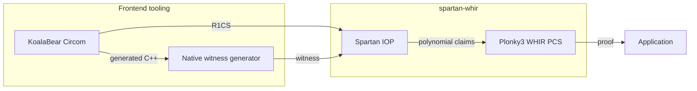

# spartan-whir

`spartan-whir` is a Spartan-based SNARK over the KoalaBear field. It combines the Spartan R1CS IOP with Plonky3's WHIR polynomial commitment scheme and provides no-ZK and full-ZK proving with DirectSparse or Spark matrix closing. Poseidon1 and Poseidon2 transcript engines are available as separate Rust types.

## Architecture



The frontend is the [KoalaBear Circom fork](https://github.com/alxkzmn/circom/tree/koala-bear). The proof system combines [Spartan](https://eprint.iacr.org/2019/550) with the [Plonky3 WHIR implementation](https://github.com/Plonky3/Plonky3/tree/main/whir). Full-ZK proving follows [Zero-Knowledge IOPPs for Constrained Interleaved Codes](https://eprint.iacr.org/2026/391).

## Quick Start

This example compiles a KoalaBear Circom circuit, generates a witness, creates 116-bit full-ZK DirectSparse keys over the quintic extension, proves the witness, and verifies the proof. It requires a Circom 2.2 build with KoalaBear support, a C++ compiler, GMP, and the `nlohmann-json` headers.

Create `example.circom`:

```circom
pragma circom 2.2.0;

template Example() {
    signal input x;
    signal input secret;
    signal output y;
    signal t0;
    signal t1;
    signal t2;

    t0 <== x * secret;
    t1 <== t0 + x;
    t2 <== t1 * t1;
    y <== t2 + 3;
}

component main { public [x] } = Example();
```

Create `input.json`:

```json
{ "x": "5", "secret": "7" }
```

Compile the circuit and generate the witness:

```bash
mkdir -p build
circom example.circom --prime koalabear --r1cs --c -o build
make -C build/example_cpp
build/example_cpp/example input.json build/example.wtns
```

Generate the proving and verifying keys:

```bash
cargo run --release --features parallel --example end_to_end -- \
  setup build/example.r1cs build/proving-key.bin build/verifying-key.bin
```

Generate a proof:

```bash
cargo run --release --features parallel --example end_to_end -- \
  prove build/proving-key.bin build/example.wtns build/proof.bin \
  build/public-inputs.bin
```

Verify it:

```bash
cargo run --release --features parallel --example end_to_end -- \
  verify build/verifying-key.bin build/public-inputs.bin build/proof.bin
```

Setup is circuit-specific and reusable across witnesses. Verification requires the public inputs selected by the application. The `prove` command writes `public-inputs.bin` for convenience; a verifier must obtain the expected values from a trusted application boundary rather than trust a copy supplied with the proof.

The example uses fixed-integer `bincode`, rejects trailing bytes, applies role-specific decoding limits, rebuilds omitted proving-key caches, and authenticates restored verifying keys.

## Public API

#### Supported configurations

Privacy and matrix closing are independent:

| Privacy | DirectSparse | Spark |
| --- | ---: | ---: |
| No ZK | Implemented | Implemented |
| Full ZK | Implemented | Implemented |

The no-ZK API uses `PoseidonProvingKey`, `PoseidonVerifyingKey`, `PoseidonProof`, and `PoseidonSpartanProtocol`. The full-ZK API uses `PoseidonZkProvingKey`, `PoseidonZkVerifyingKey`, `PoseidonZkProof`, and `PoseidonZkSpartanProtocol`. Set `PoseidonZkSetupConfig::matrix_closing` to choose DirectSparse or Spark.

`PoseidonEngine<Ext>` uses the Plonky3 Poseidon2 transcript and Merkle hashing. `Poseidon1Engine<Ext>` uses the width-16 KoalaBear Poseidon1 permutation with an eight-element rate. Both engines are always present in the library; the `poseidon1` Cargo feature selects Poseidon1 in comparison benchmarks and fixture binaries.

Quartic and quintic extensions are covered by the protocol test matrix. Octic is available through the engine API. For the selected 116-bit configuration, use `QuinticExtension` with `recommended_quintic_whir_params` or `recommended_quintic_zk_whir_params`. Spark uses separate recommended helpers for witness, fixed-value, fixed-audit, and read-table openings.

#### Key setup and loading

Keys returned by setup are ready to use. A deserialized proving key must rebuild its derived caches before proving:

```rust
let mut pk: PoseidonProvingKey<QuinticExtension> =
    bincode::deserialize(&pk_bytes)?;
pk.prepare_for_proving()?;
let proof = pk.prove(witness, public_inputs)?;
```

A deserialized verifying key must authenticate its relation and fixed commitments once before verification:

```rust
let mut vk: PoseidonZkVerifyingKey<QuinticExtension> =
    bincode::deserialize(&vk_bytes)?;
vk.authenticate()?;
vk.verify(&expected_public_inputs, &proof)?;
```

DirectSparse authentication validates and hashes the embedded R1CS. Spark authentication also reconstructs the public matrix tables and checks their fixed WHIR commitments.

#### Linked witness generation

`PoseidonWitnessGenerator` loads a generated native witness library once and passes application input bytes directly to the linked function. Public values are ordered as `public_outputs || public_inputs`; the witness buffer contains the remaining witness columns. `prove_from_witness_generator_checked` adds a complete R1CS satisfaction check for diagnostics.

#### Relation and transcript binding

Every `v1` Spartan domain separator binds a canonical SHA-256 digest of the complete padded A, B, and C matrices, their original and padded dimensions, the field and column layout, and the security- and transcript-relevant configuration. Equivalent sparse encodings are combined, normalized, and sorted before hashing. This follows the generated-statement mitigation in [How to prove more false statements: Fiat–Shamir limitations on (generated) R1CS](https://eprint.iacr.org/2026/1838): the generated R1CS relation is bound before the first Fiat–Shamir challenge.

The domain separator and expected public inputs are absorbed before the first proof commitment or dependent Fiat-Shamir challenge. Restored-key authentication recomputes the relation digest before accepting serialized key material. An application restricted to one circuit must authorize the complete verifying key, or the relation digest together with every relevant configuration value.

Poseidon2 transcripts use `spartan-whir-no-zk-v1` and `spartan-whir-full-zk-v1`. Poseidon1 transcripts use `spartan-whir-poseidon1-no-zk-v1` and `spartan-whir-poseidon1-full-zk-v1`. The proof's matrix-closing mode must match the verifying key.

#### Compact proof transport

`Poseidon1ZkSpartanProtocol::prove_compressed_with_rng` and the corresponding Poseidon2 method produce compact full-ZK Spark proofs. `CompressedZkProofFor::to_bytes` and `from_bytes` implement the `SPC2` encoding, and `verify_compressed` restores derived values before ordinary verification. `ProofCompressionOptions::recommended()` selects the retained compact encoding.

The authenticated fixed-oracle cache is an optional native transport that omits initial fixed rows and Merkle siblings. It requires a matching authenticated key and retains the fixed codeword and Merkle tree in memory. LeanVM fixtures include their fixed openings directly.

#### LeanVM fixtures

The deterministic control fixture in [`testdata/leanvm-m0`](testdata/leanvm-m0) defines the no-ZK Poseidon2, quintic, DirectSparse word encoding and statement boundary. Its [fixture README](testdata/leanvm-m0/README.md) documents the encoding and rejection cases.

```bash
cargo run --release --bin leanvm-m0-fixture -- testdata/leanvm-m0
cargo test --release --test leanvm_m0
```

Generate a Poseidon1 full-ZK DirectSparse fixture with:

```bash
cargo run --release --features poseidon1 --bin leanvm-full-zk-fixture -- \
  <output-directory>
```

Generate the selected Poseidon1 full-ZK Spark fixture with:

```bash
SPARK_FRESH_MASK_BATCHING=same_height \
SPARK_MASK_PACKING=all_free_basis \
cargo run --release --features poseidon1 --bin leanvm-full-zk-spark-fixture -- \
  <output-directory>
```

The generators write the guest input, fixed verifier data, application statement, transcript trace, layout where applicable, artifact hashes, and rejection inputs.

## Testing

Run the complete default test suite:

```bash
cargo test
```

Run the Poseidon1 and parallel feature coverage:

```bash
cargo test --features parallel,poseidon1
```

The large `2^22`-witness protocol test is ignored by default:

```bash
cargo test protocol_e2e_target_2_pow_22 -- --ignored
```

## Benchmarks

Benchmark outputs are local development artifacts. Write reports under the ignored `benchmark-results/` directory and update the dated results below after a relevant implementation or configuration change.

#### SHA-256 proving and verification

Build the optimized 2,048-byte SHA-256 R1CS and linked witness generator:

```bash
tests/circuits/build_sha256_optimized_fixture.sh \
  ../circom/target/release/circom
```

Run the Criterion comparison:

```bash
RUSTFLAGS='-C target-cpu=native -C debuginfo=0' \
RAYON_NUM_THREADS=12 \
SHA256_BENCH_WORKDIR=target/sha256-optimized-cache \
cargo bench --features parallel --bench sha256_full_zk
```

`SHA256_ZK_BENCH_SIZE` selects the cached circuit size and defaults to 2048 bytes. `SHA256_ZK_BENCH_EXTENSION` selects the extension comparison, `SHA256_ZK_BENCH_SECURITY_BITS` defaults to 116, and `SHA256_ZK_BENCH_CORPUS_SIZE` defaults to 16. The benchmark times linked witness generation plus proving and times verification separately.

Circuit details, fixture regeneration, and diagnostic examples are documented in [`tests/circuits/README.md`](tests/circuits/README.md).

#### Spark proof encoding

Run the selected compact-proof comparison with:

```bash
RUSTFLAGS='-C target-cpu=native -C debuginfo=0' \
RAYON_NUM_THREADS=12 \
SHA256_BENCH_WORKDIR=target/sha256-optimized-cache \
SPARK_FRESH_MASK_BATCHING=same_height \
SPARK_MASK_PACKING=all_free_basis \
SPARK_COMPRESSION_VARIANTS=refined_metadata,fixed_cache \
cargo bench --features parallel,poseidon1 --bench spark_proof_compression
```

`SPARK_COMPRESSION_PHASES` selects `witness_prove`, `end_to_end`, `encode`, `decode_verify`, `native_verify`, `cache_prepare`, or `cache_build`; it defaults to all phases. `SPARK_COMPRESSION_SIZES_ONLY=1` performs correctness and size checks without timing. `SPARK_COMPRESSION_REPORT` selects the local JSON report path.

#### Sumcheck replay

```bash
RUSTFLAGS='-C target-cpu=native -C debuginfo=0' \
cargo bench --bench sumcheck_replay --features parallel -- --noplot
```

#### Selected results (2026-09-08)

The selected production configuration is Poseidon1, quintic full ZK, Spark matrix closing, same-height fresh-mask batching, and `MaskPacking::AllFreeBasis`.

| Measurement | Result |
| --- | ---: |
| Compact native proof, median | 1,838,906 bytes |
| One-thread native verification | 55.938 ms |
| Paired client-prover change | +1.270%, 95% interval [-1.271%, +4.175%] |
| LeanVM guest input | 1,908,236 bytes |
| LeanVM execution | 15,794,726 cycles |
| LeanVM memory | 19,035,621 cells |
| LeanVM padded execution table | `2^24` |
| LeanVM padded extension-operation table | `2^20` |
| LeanVM padded Poseidon table | `2^17` |
| LeanVM padded memory table | `2^25` |

The compact proof is 16.906% smaller and one-thread native verification is 27.657% faster than the unpacked same-height configuration. The paired prover interval does not establish a one-percent upper bound. The native measurements use the source immediately before the protocol-identifier length-prefix correction; rerun them before treating the numbers as measurements of a later implementation. The selected LeanVM fixture includes the length-prefixed identifier and all 17 production mutations reject.

The optional authenticated fixed-oracle cache reduced proof bytes by 12.192% and warm decoding plus verification by 1.412% in the matched run while retaining approximately 272 MiB of fixed tables.
